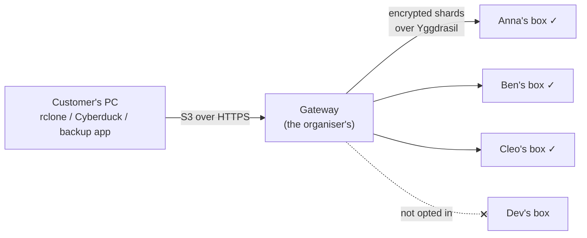
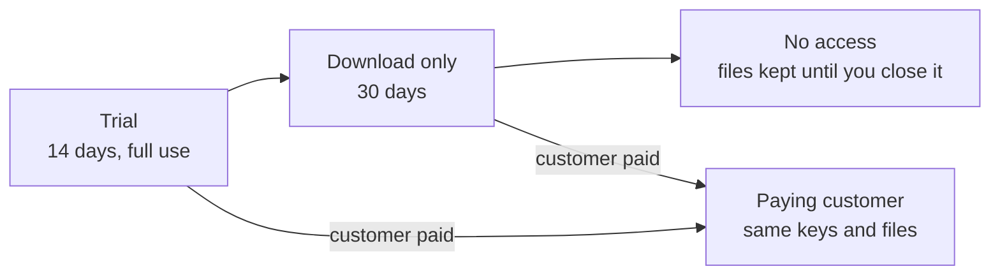

# The gateway: storage for people without a box

Not everyone wants to run a storage box. The gateway lets them **pay a
monthly fee** and use the group's storage from programs they already have.
It speaks the **S3 protocol**, which almost every backup and sync program
understands: rclone, Cyberduck, Duplicati, Arq, Veeam and many more.



- The gateway encrypts each object, cuts it into 6 pieces and spreads them
  over the members' boxes, like any other upload.
- **Members choose** whether their box holds customers' data. The space they
  give to customers is metered and **earns them credit**.
- The organiser **bills customers by hand** at first (an EFT invoice each
  month). The gateway meters what each customer stores and downloads, and
  you can suspend an account that isn't paid.

> [!WARNING]
> This is new and experimental. Before taking money, read
> [Things to know](#things-to-know): you need terms of service, a backup of
> the gateway's directory, and to be clear with customers about what this is.

- [For the organiser](#for-the-organiser)
- [For members](#for-members)
- [For customers](#for-customers)
- [Things to know](#things-to-know)

---

## For the organiser

### What you need

- **A machine for the gateway with its own Yggdrasil address.** Nodes tell
  customer uploads apart by the address they come from. So the gateway can't
  share a machine with your own node: a small VPS, a second box, or a Docker
  container with its own Yggdrasil (like the test nodes in `docker/`).
- **A public HTTPS address** for customers, such as `s3.yourgroup.example`.
  The easiest way is [Caddy](https://caddyserver.com) in front of the gateway;
  it gets a certificate by itself. At home this needs port 443 forwarded to
  the machine. On a VPS it just works.
- **At least 3 machines in the group whose owners opted in**, so any one
  can fail without losing data.

### The easy way: Docker

On a VPS (or any Linux machine with ports 80 and 443 open to the
internet), Docker does all of the steps below in one go. It runs the gateway
with its own Yggdrasil, and [Caddy](https://caddyserver.com) for HTTPS.

1. Point a domain name at the machine, such as `s3.yourgroup.example`
   (an `A` record with its public IP).
2. On your admin dashboard, make an invite for the gateway (**Invite someone**).
3. On the gateway machine, install
   [Docker](https://docs.docker.com/engine/install/), get the yggstore
   source, and run the setup:

   ```sh
   git clone https://github.com/peterretief/yggstore
   cd yggstore
   scripts/gateway-docker.sh setup
   ```

   It asks for the domain, your name and the invite. It builds everything
   from source, joins the group, and gets a certificate.
4. `setup` prints the gateway's entry. On your admin machine, add
   `"gateway": true` to it in `peers.json`. The gateway starts by itself
   within a minute of the list reaching it.

Then:

| Command | What it does |
|---|---|
| `scripts/gateway-docker.sh status` | The group, the gateway's address, and whether HTTPS works |
| `scripts/gateway-docker.sh customer add -name "Ann" -trial 14d` | Add a customer; every `customer` command below works the same way |
| `scripts/gateway-docker.sh report` | This month's usage |
| `scripts/gateway-docker.sh backup` | Copy accounts and object keys to `deploy/gateway/backups/` |
| `scripts/gateway-docker.sh up` | Rebuild and restart, after a `git pull` |
| `scripts/gateway-docker.sh logs` | Follow the logs |

Everything lives in `deploy/gateway/data/`: the Yggdrasil key (the
gateway's address), the member list, and `node/gateway/`, the directory
described below. Back it up as the next section says. If the Yggdrasil peers
in the invite don't suit the machine, set `YGG_PEERS` in
`deploy/gateway/.env` and run `up`.

For a first run, work through the checklist in
[Testing the gateway in Docker](gateway-docker-test.md).

The rest of this section does the same by hand.

### 1. Add the gateway to the group

On the gateway machine, install Yggdrasil and yggstore as in the
[box guide](storage-box-guide.md) (steps 5–7), then join with an invite as
usual, **without** `-service`:

```sh
yggstore join -name gateway -me "Your name" 'yggjoin1:…'
```

On your admin machine, open `peers.json` and mark that entry as the gateway:

```json
{"name": "gateway", "addr": "[200:…]:7400", "owner": "Your name", "gateway": true}
```

The dashboard sends the changed list to every node within a minute. Run the
node part (`yggstore serve …`, as `join` printed) on the gateway machine too,
so it shows as up on the dashboards. Don't store your own files from this
machine: everything uploaded from its address counts as customers' data.

### 2. Run the gateway

```sh
yggstore gateway serve -listen 127.0.0.1:9000 -trust-proxy
```

and Caddy in front of it, in `/etc/caddy/Caddyfile`:

```
s3.yourgroup.example {
    reverse_proxy 127.0.0.1:9000
}
```

To start it with the machine, here is a systemd user service in
`~/.config/systemd/user/yggstore-gateway.service`:

```ini
[Unit]
Description=yggstore gateway
After=network-online.target

[Service]
ExecStart=/usr/local/bin/yggstore gateway serve -listen 127.0.0.1:9000 -trust-proxy
Restart=on-failure

[Install]
WantedBy=default.target
```

```sh
systemctl --user enable --now yggstore-gateway
sudo loginctl enable-linger $USER
```

The gateway keeps everything in `~/.yggstore/gateway`:

| File | What it holds |
|---|---|
| `customers.json` | Accounts and their secret keys |
| `links/` | One-time links to customers' keys |
| `objects/` | Every object's record, **including its decryption key** |
| `uploads/` | Large uploads still in progress |
| `usage/` | Metering, one file per month |
| `trash/` | Deletes that failed, retried every hour |

> [!IMPORTANT]
> **Back up `~/.yggstore/gateway` every day, somewhere else.** Without
> `objects/`, nobody can rebuild customers' files, even though every piece
> is safe on the members' boxes. Keep the backup private: it holds the keys.

### 3. Add a customer

```sh
yggstore gateway customer add -name "Acme Ltd" -email ops@acme.example \
  -plan "100 GB, R60/month" -quota 100 -endpoint https://s3.yourgroup.example
```

This prints a message to send them, with a **one-time link to their keys**,
so you never send the secret key itself. Give `-endpoint` once; it is
remembered.

- Opening the link shows a **Show my keys** button. The keys appear when it
  is pressed, and the link then stops working. Link previews in WhatsApp or
  email only open the page, so they don't use it up.
- The link expires after 7 days. `customer link WHO` makes a new one and
  cancels any unused one.
- If someone says the link was already used and it wasn't them, give them a
  new secret with `customer new-secret WHO`.
- `-keys` prints the keys themselves instead, as before.

### Free trials

Let people try it before they pay:

```sh
yggstore gateway customer add -name "Thandi" -email thandi@example.org -trial 14d
```

A trial gets 5 GB unless you give `-quota`.



- **When the trial ends**, they can still download and delete their files
  for 30 days, but not upload. Their program shows why: "your free trial
  ended on …; contact the group's organiser".
- **After those 30 days** the keys stop working. The files stay on the
  members' boxes until you close the account.
- `customer list` shows each trial's state: days left, download only, or
  ended.

| Command | What it does |
|---|---|
| `yggstore gateway customer extend WHO 7d` | A longer trial (from today, if it already ended) |
| `yggstore gateway customer paid WHO -plan "100 GB, R60/month" -quota 100` | Ends the trial; keys and files stay the same |
| `yggstore gateway customer close WHO -yes` | Deletes all their files from the group and stops the account. Use it for trials that didn't continue. |

### Managing customers

| Command | What it does |
|---|---|
| `yggstore gateway customer list` | Lists every account, with its state |
| `yggstore gateway customer link WHO` | A new one-time link to their keys |
| `yggstore gateway customer show WHO` | Prints their keys |
| `yggstore gateway customer quota WHO 200` | Changes their space, in GB (0 = unlimited) |
| `yggstore gateway customer suspend WHO` | Stops access; their files are kept |
| `yggstore gateway customer resume WHO` | Gives access back |
| `yggstore gateway customer new-secret WHO` | Replaces a leaked secret key, and prints a link to the new one |

`WHO` is the customer's ID, access key or exact name. Changes apply at once,
without restarting the gateway. Closing an account deletes its files within
the hour.

### 4. Each month

```sh
yggstore gateway report -month 2026-10
```

```
Usage for 2026-10 (up to 31 Oct 23:50 UTC)

Customers
   Customer               Plan  GB-months  Now GB  Peak GB  Up GB  Down GB  Requests
   Acme Ltd  100 GB, R60/month     42.310   48.02    48.02  51.20     3.90     18342

Members (space held for customers, shards included)
   Member  GB-months  Share  Now GB
     Anna     30.101  47.4%   34.20
      Ben     20.002  31.5%   22.71
     Cleo     13.400  21.1%   15.12
```

- **GB-months** is what to bill: 1 GB stored for the whole month is 1
  GB-month, and 30 GB for half a month is 15. Charge for the plan, or for
  GB-months above it, as you prefer.
- **Members' share** is how much of the customers' data each member's boxes
  held over the month. Split credit or fees by it. Members hold about 1.5×
  what customers store, because each object is stored as 6 pieces, any 4 of
  which rebuild it.
- Suspend accounts that don't pay. Their files stay until you decide.
- Trials are marked "(trial)" in the report, so you can see who is using
  theirs.

---

## For members

Holding customers' data is **your choice** and is **off by default**. When
you opt in, your box holds encrypted pieces of paying customers' files, and
the space they take is credited to you in the monthly report.

To opt in, add `-customers` to your node, either when joining:

```sh
yggstore join -service -customers … 'yggjoin1:…'
```

or later, by adding `-customers` to the `yggstore serve` line in
`~/.config/systemd/user/yggstore-node.service`, then:

```sh
systemctl --user daemon-reload
systemctl --user restart yggstore-node
```

Your box then shows a **customers** badge on the dashboards, and the
"Give and use" table shows how much you hold for paying customers.

- Your box enforces this itself: without `-customers` it refuses pieces from
  the gateway.
- Opting out stops new customer data. What your box already holds stays
  until those customers delete it; yggstore can't move data yet.
- You can't read customers' data. The pieces are encrypted, and with the
  recommended setup customers encrypt everything before it leaves their PC.

---

## For customers

You've been given a link to your keys. Open it, press **Show my keys**, and
save the **endpoint**, **access key** and **secret key** in your password
manager: the page only opens once.
Any program that supports "S3 compatible storage" works. Use these settings:

| Setting | Value |
|---|---|
| Provider / service | S3 compatible, "Other" or "Generic S3" |
| Endpoint / server | the endpoint you were given, e.g. `https://s3.yourgroup.example` |
| Region | `us-east-1` (any works) |
| Addressing | **path-style** (sometimes "use path-style access" or "force path style") |

Create a **bucket** first (a top-level folder). Its name must be 3–63
lower-case letters, digits, hyphens or dots, such as `acme-backup`.

> [!TIP]
> **Turn on your program's own encryption.** Then your files are encrypted
> on your PC before they're sent, and nobody else can read them: not the
> organiser, and not the people whose boxes hold the pieces. rclone calls
> this `crypt`, Duplicati and Arq do it by default, and Cyberduck calls it
> Cryptomator vaults. **Keep the password safe: without it, nobody can
> recover your files.**

### rclone (Windows, Mac, Linux)

Install [rclone](https://rclone.org/downloads/), then put this in its config
file (`rclone config file` shows where) with your own keys:

```ini
[group]
type = s3
provider = Other
access_key_id = YOUR_ACCESS_KEY
secret_access_key = YOUR_SECRET_KEY
endpoint = https://s3.yourgroup.example
force_path_style = true

[safe]
type = crypt
remote = group:acme-backup/encrypted
password = RUN: rclone obscure "your long passphrase"
```

Replace the `password` line with the output of
`rclone obscure "your long passphrase"`. Then:

```sh
rclone mkdir group:acme-backup
rclone sync C:\Users\you\Documents safe:Documents --progress
rclone check C:\Users\you\Documents safe:Documents
rclone copy safe:Documents\report.docx C:\restore
```

Use `rclone sync` on a schedule (Windows Task Scheduler, cron) for a
nightly backup.

### Cyberduck (Windows, Mac)

Open Connection → **Amazon S3**, server: your endpoint without `https://`,
then your access key and secret key. If the bucket list doesn't show, use the
"S3 (Deprecated path style requests)" profile from Preferences → Profiles.

### Duplicati (Windows backups)

Add backup → Destination **S3 Compatible** → Server **Custom server URL**:
your endpoint without `https://`, then your bucket name, keys and a folder
path. Duplicati encrypts with your passphrase by default; keep it.

### What works

| Works | Not supported |
|---|---|
| Buckets: create, list, delete | Versioning, object lock |
| Upload (up to 5 GiB at once; larger as multipart, up to 10,000 parts) | Access rules (ACLs, bucket policies), public buckets |
| Download, including byte ranges and resuming | Lifecycle rules, tags, storage classes |
| Listing with prefixes and folders | Website hosting, events |
| Server-side copy and move (free and instant) | Signature Version 2 (except share links) |
| Delete, including many at once | |
| Share links (presigned URLs), up to 7 days | |

---

## Things to know

- **The gateway is a single point of failure.** If it's down, customers
  can't reach their files, although every piece is safe on the members'
  boxes. If its directory is lost without a backup, the files can't be
  rebuilt. Back it up.
- **Pieces aren't repaired yet.** If a member's box dies for good, the pieces
  it held are gone. Each object survives losing any 2 of its 6 pieces, but a
  second and third loss before repair would lose data. Repair is planned.
- **Without client-side encryption, the gateway sees customers' files.** It
  encrypts them before storing, but it holds the keys. Recommend `crypt`, or
  the equivalent in your customers' program, to everyone.
- **Legal.** Taking money to store other people's data comes with duties:
  terms of service that say what you promise (and what you don't), privacy
  law where you and your customers are (POPIA in South Africa, GDPR in the
  EU), and what you do if a customer stores something unlawful. Get advice
  before you sell to the public. Members should know what opting in means.
- **No bandwidth limits.** Downloads are metered for the report, not capped.
- **Billing is by hand.** A card provider (PayFast, Paystack or similar) can
  be added later. The metering it would need is already in place.
