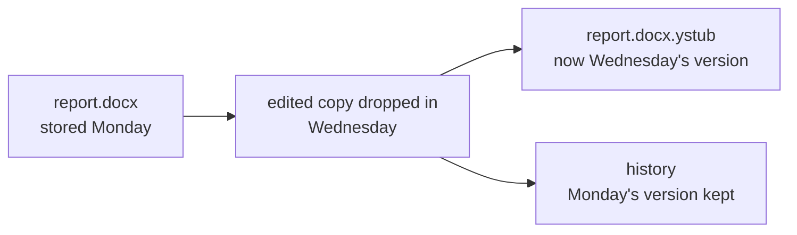

# History: every version of your files

When you store a file again, yggstore keeps the old version too. You can
restore any version, or a whole folder as it was on a given day.



## Making a new version

- **Usual outbox** (originals are replaced by stubs): drop the changed file
  into the same place, beside its `.ystub`. It's stored as the new version,
  and the stub then points to it.
- **With `-keep`** (originals stay where they are): just edit the file. A few
  seconds after you stop changing it, the new version is stored.
- **Folders kept whole** (in `whole/`) work the same way.

Putting back a file that hasn't changed, such as a restored copy, doesn't
make a new version.

## Only the changes are stored

Files are stored in 4 MiB chunks. A new version reuses every chunk that
didn't change, so editing part of a big file, or adding to the end of a log
or a mailbox, only stores the chunks that changed. The activity log says how
many:

```
stored Docs/report.bin (file, 8.6 MiB, 3 chunks on 6 nodes, 1.4s, read-back
verified; new version, 1 of 3 chunks changed, previous version kept in history)
```

Inserting something near the start of a file shifts everything after it, so
then most chunks change. Files stored before history existed have no record
of their chunks, so their first new version is stored in full.

## Restoring

On the dashboard, a file with older versions shows **Show N older
versions** under its buttons. Each version has its date and a **Restore this
version** button. It goes to the restore folder with its date in the name,
such as `report (5 Oct 2026 14.32).docx`, so it never overwrites anything.

To get a **folder as it was**, open **Restore a folder as it was at a date**
under "Your files", pick the folder and the date, and press Restore. Each
file comes back as the latest version stored by then; files stored only
later are left out. The folder appears in the restore folder as
`Project (as of 1 Oct 2026 14.00)`.

From the command line:

```sh
yggstore history outfiles/Docs/report.docx.ystub          # list the versions
yggstore history -restore 20261005T121453Z-52f52e09.ystub outfiles/Docs/report.docx.ystub
yggstore history -outfiles outfiles -folder Docs -at "2026-10-01 14:00"
```

## How long versions are kept

The latest **20 older versions** of each file are kept; older ones are
deleted from the group as new ones arrive. Older versions take up space in
the group like anything else, and count towards what you use.

Deleting a file (the dashboard's **Delete**, `yggstore rm`, or dropping its
stub into `delete/`) deletes **every version**.

## The activity log

Everything the dashboard reports (stores, new versions, restores and where
they went, deletes, nodes going up and down) is also written to
`outfiles/.yggstore/activity.log`, so it's still there after a restart:

```
2026-10-05 17:15:48 ok    stored history-test/report.bin (… new version, 1 of 3 chunks changed …)
2026-10-05 17:16:26 ok    restored report (5 Oct 2026 17.14).bin (8.6 MiB) to /home/…/restored/report (5 Oct 2026 17.14).bin
```

It is rotated at 5 MB (the previous one is kept as `activity.log.1`).

## Things to know

- Versions live in `outfiles/.yggstore/history/`. Like stubs, they hold the
  keys to your files: back them up with the rest of `outfiles`, and keep them
  private.
- Moving a stub to another folder keeps its history. Restoring a folder as
  of a date uses where stubs are now.
- A chunk reused by a newer version shares its pieces with the older one. If
  those pieces are lost, both versions lose that chunk. Repair is planned.
