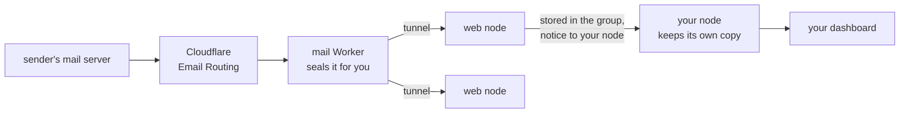

# Email on the group

Email to your domain can arrive on the group instead of at a mailbox
provider. Each message is encrypted for you as it comes in, stored in
pieces across the group like your files, and read on your dashboard.



- **Cloudflare Email Routing** receives mail for the domain and hands each
  message to a small Worker (`deploy/mail-worker`).
- **The Worker** encrypts the message for your sharing code (the same one
  people use to send you files) and posts it to a web node through the
  group's tunnel. From here on only you can read it.
- **The web node** stores it in the group and tells your node. If no web
  node can take it, the Worker fails and the sending server tries again
  later, as mail servers do.
- **Your node** fetches it, keeps it in your mailbox (`~/.yggstore/mail`),
  stores a copy of its own in the group (so a lost disk loses no mail),
  and then lets the web node delete the first copy. A node that was off
  collects its mail when it's back.
- **Your dashboard** lists and shows your mail as plain text, with
  attachments and the whole message (`.eml`) to download. `yggstore mail
  list` and `yggstore mail read ID` do the same in a terminal.

Sending mail isn't built yet; it will go through an SMTP relay.

## What it protects, and what it doesn't

Mail stored on the group is as safe as your files: the web nodes and the
members holding pieces see only ciphertext. But email itself is not
private. Cloudflare sees every message before the Worker seals it, and the
sender's servers keep their own copies. Treat it as ordinary email that is
stored well, not as a private channel.

## Setting it up

You need web nodes with a tunnel ([websites](sites.md), steps 1–3), and a
domain on Cloudflare whose mail isn't used for anything else yet.

### 1. A token for the Worker

On one web node:

```sh
yggstore mail token ~/.yggstore/mail-in.token
```

Copy that file to the other web nodes (same path, kept private), and add
`-mail-in ~/.yggstore/mail-in.token` to each web node's `serve` command.
Restart them.

### 2. A name for the Worker to reach the web nodes

In the Cloudflare dashboard, add a route to the web nodes' tunnel
(Networks › Tunnels › the tunnel › Published application routes): say
`mail-in.example.org` to `http://localhost:8480`.

### 3. Your mailbox

On the machine you'll read mail on (its node collects your mail, its
dashboard shows it):

```sh
yggstore mail address you@example.org
```

prints your entry for the Worker:

```
"you@example.org": {"code":"ys1…","node":"200:…"}
```

### 4. The Worker

```sh
cd deploy/mail-worker
cp wrangler.example.jsonc wrangler.jsonc
```

In `wrangler.jsonc` set `INGEST_URL` to `https://mail-in.example.org/_yggstore/mail`
and put your entry (and anyone else's) in `MAILBOXES`. A
`"*@example.org"` entry takes the domain's other addresses. Then:

```sh
yggstore mail token ~/.yggstore/mail-in.token | npx wrangler secret put INGEST_TOKEN
npx wrangler deploy
```

`wrangler.jsonc` holds real addresses and node IDs, so it is kept out of
git.

### 5. Send the domain's mail to the Worker

In the Cloudflare dashboard, open the domain's Email › Email Routing, turn
it on (it adds the MX and SPF records), and under Routing rules send your
address, or the catch-all, to the Worker `yggstore-mail`.

Send yourself a message. It shows on your dashboard within a minute.

## When something goes wrong

- **Nothing arrives**: the Worker's logs (`npx wrangler tail`) show what
  the web node answered. 403 means the tokens differ; 503 means the web
  node couldn't store the message or reach your node (the sender retries).
- **A web node's log** says `mail: took ID for NODE` for each message, and
  your node's says `mail: collected ID`.
- **"Can't open this message"** on the dashboard: it was sealed for another
  sharing code. Check that `MAILBOXES` has the code `yggstore mail address`
  prints on this machine.
