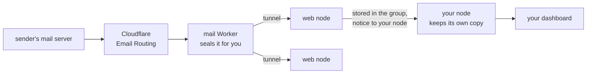

# Email on the group

Email to your domain can arrive on the group instead of at a mailbox
provider. Each message is encrypted for you as it comes in, stored in
pieces across the group like your files, and read on your dashboard.



- **Cloudflare Email Routing** receives mail for the domain and hands each
  message to a small Worker (`deploy/mail-worker`).
- **The Worker** encrypts the message for your sharing code (the same one
  people use to send you files) and posts it to a web node through the
  group's tunnel. From here on only you can read it.
- **The web node** stores it in the group and tells your node. If no web
  node can take it, the Worker fails and the sending server tries again
  later, as mail servers do.
- **Your node** fetches it, keeps it in your mailbox (`~/.yggstore/mail`),
  stores a copy of its own in the group (so a lost disk loses no mail),
  and then lets the web node delete the first copy. A node that was off
  collects its mail when it's back.
- **Your dashboard** lists and shows your mail as plain text, with
  attachments and the whole message (`.eml`) to download. `yggstore mail
  list` and `yggstore mail read ID` do the same in a terminal.

Sending goes the other way: your dashboard (or `yggstore mail send`)
writes the message and hands it to a web node over Yggdrasil, which checks
that the From address is yours and passes it to an SMTP relay such as
SMTP2GO. Only the web nodes hold the relay's password. A copy goes in your
Sent list, stored in the group like your received mail. See
[Sending](#sending) below.

## What it protects, and what it doesn't

Mail stored on the group is as safe as your files: the web nodes and the
members holding pieces see only ciphertext. But email itself is not
private. Cloudflare sees every message before the Worker seals it, and the
sender's servers keep their own copies. Treat it as ordinary email that is
stored well, not as a private channel.

## Setting it up

You need web nodes with a tunnel ([websites](sites.md), steps 1–3), and a
domain on Cloudflare whose mail isn't used for anything else yet.

### 1. A token for the Worker

On one web node:

```sh
yggstore mail token ~/.yggstore/mail-in.token
```

Copy that file to the other web nodes (same path, kept private), and add
`-mail-in ~/.yggstore/mail-in.token` to each web node's `serve` command.
Restart them.

### 2. A name for the Worker to reach the web nodes

In the Cloudflare dashboard, add a route to the web nodes' tunnel
(Networks › Tunnels › the tunnel › Published application routes): say
`mail-in.example.org` to `http://localhost:8480`.

### 3. Your mailbox

On the machine you'll read mail on (its node collects your mail, its
dashboard shows it):

```sh
yggstore mail address you@example.org
```

prints your entry for the Worker:

```
"you@example.org": {"code":"ys1…","node":"200:…"}
```

### 4. The Worker

```sh
cd deploy/mail-worker
cp wrangler.example.jsonc wrangler.jsonc
```

In `wrangler.jsonc` set `INGEST_URL` to `https://mail-in.example.org/_yggstore/mail`
and put your entry (and anyone else's) in `MAILBOXES`. A
`"*@example.org"` entry takes the domain's other addresses. Then:

```sh
yggstore mail token ~/.yggstore/mail-in.token | npx wrangler secret put INGEST_TOKEN
npx wrangler deploy
```

`wrangler.jsonc` holds real addresses and node IDs, so it is kept out of
git.

### 5. Send the domain's mail to the Worker

In the Cloudflare dashboard, open the domain's Email › Email Routing, turn
it on (it adds the MX and SPF records), and under Routing rules send your
address, or the catch-all, to the Worker `yggstore-mail`.

Send yourself a message. It shows on your dashboard within a minute.

## Addresses for members

Members don't need an entry in the Worker or the web nodes' files: they
ask for a name on their dashboard, and you approve it on yours.

1. Once, give the group a domain: add `"domain": "example.org"` to your
   admin entry in `peers.json`. Route the domain's catch-all to the Worker
   (step 5), and verify the domain at the relay ([Sending](#sending)).
2. A member types a name under *Your name* and asks for
   it. The request goes to the admin nodes as a message.
3. On your dashboard it shows under *Requests*: Approve adds the name, and
   the member's sharing code, to their node's entry in the list, which
   every node then gets. Decline tells them no.

From then on `anna@example.org` arrives in Anna's mailbox and her box may
send as it; `anna.example.org` is kept for her website. Her dashboard sets
the address to send from by itself. *Take back* on your dashboard ends it.
An admin's own request is given at once.

The Worker asks a web node for any address that has no entry of its own in
`MAILBOXES` (`GET /_yggstore/mailbox?to=…`, with the Worker's token), so
entries there still win, and the catch-all (`*@example.org`) still takes
addresses no one has. Web nodes need this yggstore or newer to answer;
older ones answer that no one has the address.

## Sending

Messages go out through an SMTP relay; these steps use SMTP2GO, and any
relay with SMTP login and STARTTLS (port 587) or TLS (port 465) works.

### 1. Verify the domain at the relay

In SMTP2GO: Sending › Verified Senders › Add a sender domain. Add the DNS
records it lists in Cloudflare (DNS only, not proxied) and wait until it
shows the domain as verified. Its DKIM signature then passes DMARC for
your domain without changing SPF.

If the domain has no DMARC record yet, add one, starting gently:

    _dmarc  TXT  "v=DMARC1; p=none; rua=mailto:you@example.org"

### 2. A login for the web nodes

In SMTP2GO: Sending › SMTP Users › Add SMTP User. Then on one web node:

```sh
yggstore mail relay ~/.yggstore/mail-out.json
```

makes a private file to fill in: the SMTP user and password, and under
`senders` who may send as what. `yggstore mail address` prints a member's
line (`"you@example.org": "200:…"`); `"*@example.org"` lets one node send
as any address there.

```json
{
  "smtp": "mail.smtp2go.com:587",
  "user": "…",
  "password": "…",
  "senders": {"you@example.org": "200:…"}
}
```

Copy it to the other web nodes (same path, mode 600), add
`-mail-out ~/.yggstore/mail-out.json` to each one's `serve` command and
restart them. The log says `mail: sending members' email through …`, or
why not; a mistake in the file stops sending, not the node.

### 3. Write

Your address is the one you gave `yggstore mail address`. On the
dashboard, Mail › Write, or Reply on a message. In a terminal:

```sh
echo "Hello" | yggstore mail send -to someone@example.net -subject "Hi"
```

Messages are plain text, up to 50 recipients, and each member may send 60
an hour through a web node. The web node's log says `mail: sent for NODE
from ADDRESS to N recipient(s)`; the relay's own log (SMTP2GO › Reports)
shows what happened after that.

## Thunderbird and other mail programs

The dashboard also serves your mailbox to mail programs on the same
machine, like Proton Bridge: IMAP on `127.0.0.1:2143` for reading and
filing, SMTP on `127.0.0.1:2587` for sending. Messages are opened on your
machine; nothing leaves it unsealed.

```sh
yggstore mail bridge
```

prints the settings to enter in Thunderbird (Add Mail Account, Configure
manually), with the password made for the bridge
(`~/.yggstore/mail-bridge.password`). Connection security is None:
Thunderbird warns about it, but the connection never leaves the machine.
The bridge refuses to listen on any other address.

- **Folders**: Inbox, Sent, Drafts, Trash, Archives and Junk, plus any you
  make. Read and flagged marks are kept with each message.
- **Deleting** moves a message to Trash; emptying Trash deletes it from
  the group for good. New mail, and messages deleted from the dashboard,
  show in Thunderbird within a few seconds.
- **Sending** goes through the web nodes as from the dashboard. Thunderbird
  keeps its copy in Sent, stored in the group like the rest.
- Drafts and copies Thunderbird files are stored in the group too.

Change the addresses with `-imap` and `-smtp` on `yggstore dashboard`
(`""` turns one off). yggmail, if you also run it, uses 1143 and 1025.

## When something goes wrong

- **Nothing arrives**: the Worker's logs (`npx wrangler tail`) show what
  the web node answered. 403 means the tokens differ; 503 means the web
  node couldn't store the message or reach your node (the sender retries).
- **A web node's log** says `mail: took ID for NODE` for each message, and
  your node's says `mail: collected ID`.
- **"no web node that sends mail is online"**: no web node has a working
  `-mail-out` file; check their logs.
- **"this node may not send as …"**: the address isn't one of the names
  the admin gave your node, and the web nodes' `senders` don't give it to
  your node either. A `senders` entry must be the same in every web node's
  file.
- **"the mail relay: …"** is the relay's own answer, e.g. a wrong login or
  a domain it hasn't verified.
- **"Can't open this message"** on the dashboard: it was sealed for another
  sharing code. Check that `MAILBOXES` has the code `yggstore mail address`
  prints on this machine.
