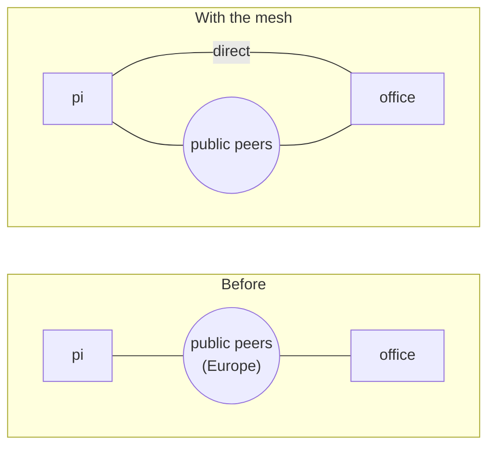

# The mesh: direct links between members

Yggdrasil finds a path to any address, but only through links that exist.
If a member's only link is a tunnel or a public peer and that goes away, the
member is cut off, even though another member could have connected to it
directly.

With the mesh, every node keeps its Yggdrasil linked straight to the other
members:

- Members that can be reached from outside list where, in the node list:
  `"ygg_listen": ["wss://ygg.yourgroup.example:443"]`.
- Once a minute, each node asks its own Yggdrasil which links are up, and
  opens a link to any member it isn't linked to directly. The link is added
  while Yggdrasil runs: no config change, no restart.
- A node only ever closes links it opened itself, when a member or address
  leaves the list. Peers you set in `yggdrasil.conf` are left alone.
- If Yggdrasil restarts, the links come back within a minute.
- Invites hand newcomers the members' addresses first, then the public
  peers.



## 1. Let yggstore use Yggdrasil's admin socket

Each node needs permission to ask its Yggdrasil about links. Without it the
node works as before, and the dashboard says "links: not managed".

**Ubuntu or Debian** (the socket belongs to the `yggdrasil` group). Add the
user yggstore runs as, then restart the node:

```sh
sudo usermod -aG yggdrasil yggstore     # or your own user, if the node runs as you
sudo systemctl restart yggstore
```

**Alpine** (the socket belongs to root). Make a group for it, and set the
socket's group each time Yggdrasil starts. Replace `yggstore` with the user
the node runs as (`dstore` on some boxes):

```sh
addgroup -S yggdrasil 2>/dev/null; addgroup yggstore yggdrasil
cat >> /etc/conf.d/yggdrasil <<'EOF'

# Lets members of the yggdrasil group use the admin socket (yggstore mesh).
start_post() {
	for i in 1 2 3 4 5; do [ -S /var/run/yggdrasil.sock ] && break; sleep 1; done
	chgrp yggdrasil /var/run/yggdrasil.sock
}
EOF
chgrp yggdrasil /var/run/yggdrasil.sock
rc-service yggstore restart
lbu commit      # on diskless Alpine, so it survives a reboot
```

**Docker** (the test nodes and the gateway kit run as root): nothing to do.

To leave a node's links alone on purpose, start it with `-ygg-admin none`.

## 2. Say where members can be reached

A member can be linked to if its Yggdrasil **listens** somewhere the others
can reach: a public IP and port, or a tunnel such as Cloudflare's. On the
admin machine:

```sh
yggstore mesh set office wss://ygg.yourgroup.example:443
yggstore mesh set vps tls://203.0.113.5:14415
```

The dashboard sends the changed list to every node within a minute.
`yggstore mesh set NODE` with no address stops listing it.

To make a machine listen, add a `Listen` entry to its `yggdrasil.conf`, such
as `"tls://0.0.0.0:14415"`, open that port in its firewall (and router), and
restart Yggdrasil.

> [!IMPORTANT]
> A machine that listens on the internet can be linked to by anyone on
> Yggdrasil. Keep the firewall rule that only lets port 7400 in over
> Yggdrasil, or set `AllowedPublicKeys` so only members may link.
> `yggstore mesh` prints the line with every member's key.

## 3. Check

```sh
yggstore mesh
```

```
NODE         LINKED DIRECTLY TO     NOTES
desktop      office, pi
pi           desktop, office
pi2          office
office       desktop, pi, pi2       listens at wss://ygg.yourgroup.example:443
```

Each node card on the dashboard shows the same, with "trying NAME?" for a
link that won't come up (hover for the reason).
