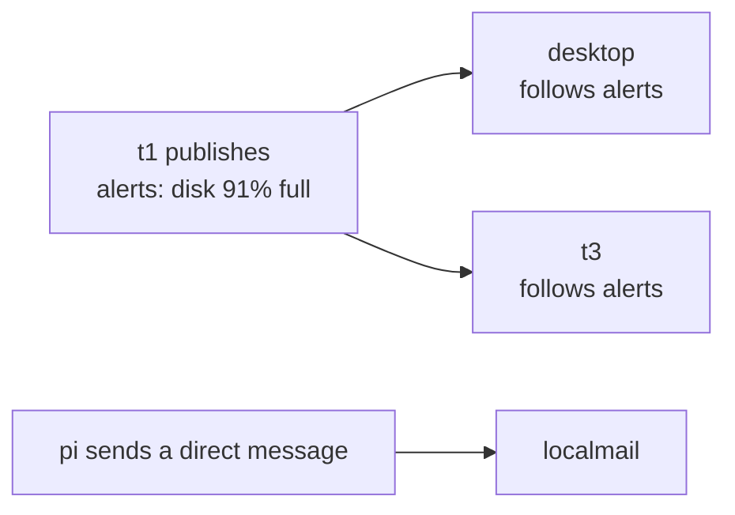

# Messaging: nodes talking to each other

Every node can message the others in the group:

- **Direct messages** go to one node.
- **Topics** are named channels, such as `alerts` or `family/photos`. Any node
  can publish to a topic, and every node that follows it gets the message.



Messages travel over Yggdrasil between members only, so you always know which
node sent each one. They are kept for 30 days.

## It copes with nodes being off

- **Nothing is lost when a node is off.** The sender keeps the message and
  keeps trying, for up to a week. As soon as the node is back, it announces
  itself and gets what was waiting, within a second or two.
- **New followers catch up.** A node that starts following a topic gets the
  last 30 days of it.
- **Gaps are filled.** Each publisher numbers its messages in each topic. A
  node that notices one missing asks the publisher for it.
- **Nothing arrives twice,** even after restarts and retries.

Messages are for short things, up to 64 KB of text. To send something bigger,
store it and send its stub in a message. File sync (coming next) works this
way.

## On the dashboard

The **Messages** section shows the topics you follow, a box to write to a node
or a topic, and the latest messages. It also lists anything still waiting to
be delivered, and to whom.

## From the command line

```sh
yggstore msg sub alerts                       # follow a topic
yggstore msg pub alerts "pi2 is back online"  # publish to everyone following it
yggstore msg send localmail "backup done"     # a direct message to one node
yggstore msg read                             # the latest messages
yggstore msg read -topic alerts -follow       # keep showing new ones as they come
yggstore msg status                           # topics, who follows what, anything undelivered
echo "long text" | yggstore msg pub notes -   # the message from stdin
yggstore msg unsub alerts
```

`yggstore msg read -topic direct` shows only direct messages.

Topic names use lower-case letters, digits and `. _ / -`, up to 64
characters. Use `/` to group them: `family/photos`, `alerts/disk`.

## For programs

The node offers a local API on `127.0.0.1:7401`, so scripts and programs on
the same machine can send, publish and follow topics: home automation,
monitoring, a chat app. It answers only on this machine, and needs the token
in `~/.yggstore/msg.token`, which only you can read.

| Request | What it does |
|---|---|
| `GET /v1/status` | Topics followed, who follows what, undelivered messages |
| `GET /v1/messages?latest=20&topic=alerts` | The latest messages (`topic` optional; `direct` for direct ones) |
| `GET /v1/messages?after=N` | Messages numbered after N, oldest first |
| `GET /v1/stream?after=N&topic=T` | New messages as they arrive ([server-sent events](https://developer.mozilla.org/docs/Web/API/Server-sent_events)) |
| `POST /v1/send` `{"to": "pi", "type": "text/plain", "body": "…"}` | Direct message (`to` is a node name) |
| `POST /v1/publish` `{"topic": "alerts", "body": "…"}` | Publish |
| `POST /v1/subscribe` / `/v1/unsubscribe` `{"topic": "alerts"}` | Follow or stop following |

Every request needs `Authorization: Bearer TOKEN`. For example, an alert from
a cron job:

```sh
curl -s -H "Authorization: Bearer $(cat ~/.yggstore/msg.token)" \
  -d '{"topic": "alerts", "body": "backup finished"}' http://127.0.0.1:7401/v1/publish
```

Each received message looks like this:

```json
{"n": 42, "received": 1791199399123, "from_name": "t1", "id": "9fa42693…",
 "from": "201:ebae:…", "topic": "alerts", "seq": 7, "time": 1791199399001,
 "type": "text/plain", "body": "t1: disk 91% full"}
```

`n` numbers messages in the order they arrived on this node. Keep the last
one you handled and ask for `after=n` to never miss or repeat one.

`type` is up to you: `text/plain`, `application/json` or your own. yggstore
only carries the body.

## Things to know

- **Every node needs this version of yggstore.** Nodes on older versions are
  skipped, and get their messages once they're updated.
- **Any member can follow any topic.** Topics are for the group, not secret
  from it. Messages are encrypted between nodes by Yggdrasil, but they are
  readable on the nodes that receive them.
- **Messages are per node, not per person.** Someone with two boxes reads
  each box's messages separately.
- **Delivery order:** one publisher's messages in a topic arrive in order, but
  messages from different publishers may interleave differently on different
  nodes.
- **This is meant for small groups.** Each publisher sends to every follower
  itself, which is simple and fast for tens of nodes. Very large groups would
  need messages passed on by other nodes; that can come later.
