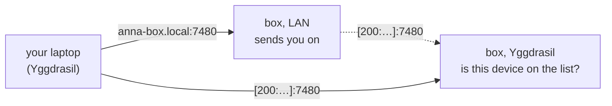

# Open your dashboard from your other devices

The dashboard has no password: whoever can open it can restore, share and
delete your files and read your mail. So by default it only answers on the
machine it runs on, at <http://127.0.0.1:7480>.

Started with `-remote` (`yggstore join -service` does this), it also opens
to **your own devices, over Yggdrasil**:

- A Yggdrasil address can only be used by the device holding its private
  key, so the address says which device is asking. You list your devices'
  addresses once, on the dashboard's machine; nobody else can add to that
  list, not even the group's admins.
- On the LAN the box has a name, such as `anna-box.local`. Opening
  <http://anna-box.local:7480> sends the browser on to the box's Yggdrasil
  address, where the device is checked. Nothing is served over the LAN
  itself.
- A device that isn't on the list is shown its own address and the command
  that would add it.



Each device needs Yggdrasil installed and running. On the same LAN it finds
the box by itself; elsewhere it needs a public peer (see
[the mesh](mesh.md#3-give-every-node-public-peers)).

## 1. Give the box a name on the LAN

Install Avahi, which answers for `HOSTNAME.local`:

```sh
sudo apt-get install -y avahi-daemon          # Debian, Ubuntu
apk add avahi && rc-update add avahi-daemon && rc-service avahi-daemon start   # Alpine
```

Windows 10 and later, macOS, iOS and Android find `.local` names by
themselves. Check from another machine with `ping anna-box.local`.

## 2. Open the doors

Let the LAN reach the dashboard (it only sends people on) and Avahi, and
Yggdrasil reach the dashboard (it checks the device):

```sh
sudo ufw allow from 192.168.0.0/16 to any port 7480 proto tcp
sudo ufw allow from 192.168.0.0/16 to any port 5353 proto udp
sudo ufw allow in on tun0 to any port 7480 proto tcp
```

With ip6tables instead of ufw, add `-A YGG-IN -p tcp --dport 7480 -j ACCEPT`
before the `DROP` and save.

## 3. Start the dashboard with -remote

`yggstore join -service` already does. Otherwise add `-remote` to the
dashboard's command (in `~/.config/systemd/user/yggstore-dashboard.service`)
and restart it:

```sh
systemctl --user daemon-reload && systemctl --user restart yggstore-dashboard
```

Its log says where it answers:

```
dashboard also on http://[200:1f12::cfd6]:7480 for the devices in /home/anna/.yggstore/devices.json, and http://anna-box.local:7480 on the LAN
```

## 4. Add your devices

On the device, open <http://anna-box.local:7480>. The first time, the page
says the device isn't on the list and shows its address. On the box:

```sh
yggstore devices add 201:5e1:8a3c::7 "anna's laptop"
```

Reload the page: it's your dashboard. The list takes effect at once.

```sh
yggstore devices                      # who may open it
yggstore devices remove "anna's laptop"
```

Remove a device when you sell or lose it. Its Yggdrasil keys are in its
`yggdrasil.conf`; anyone who copies that file can use its address.

> [!NOTE]
> The page goes over Yggdrasil, which encrypts it end to end, but the
> browser sees plain `http://`. So "copy" buttons may not reach the
> clipboard; they select the text instead, for Ctrl+C.
