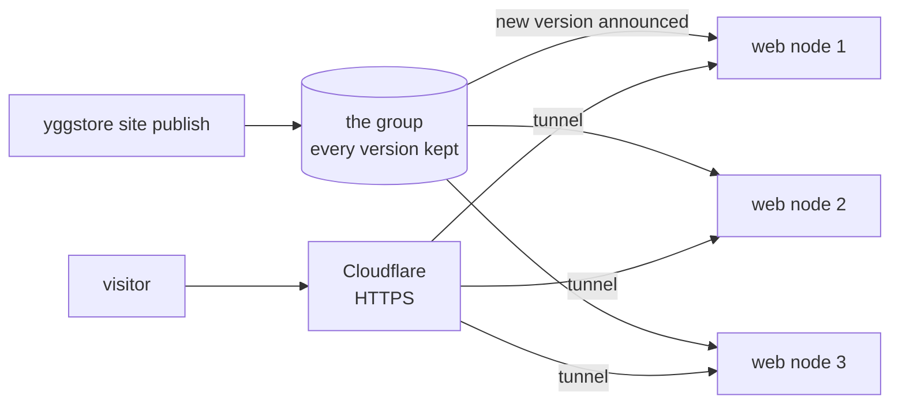

# Websites on the group

Static websites (HTML, CSS, images, JavaScript) can live on the group
instead of on one server. Several machines serve them; if one goes down, or
its whole site loses power or internet, visitors are sent to the others.



- **Publishing** stores the site's folder like any other item: encrypted,
  in pieces across the group. Every version is kept, and an update stores
  only what changed.
- **Web nodes** hear about the new version within seconds, fetch it, and
  switch to it all at once, so a visitor never sees half an update. They
  serve from their own copy, so one cut off from the group keeps serving the
  version it has. One that was off catches up when it's back.
- **Cloudflare Tunnel** gives visitors HTTPS and sends each one to a web
  node that is connected.
- A site can only be changed by the machine that first published it, or by
  an admin node.

This suits plain-file sites. Anything that runs code on the server (PHP, a
database, logins) needs a server of its own. A contact form is the
exception: web nodes take it themselves (see [A contact form](#a-contact-form)).

## 1. Choose the web nodes

Two or three machines in different places are enough: say the desktop at
home and the office machine at the other site. Add `-web 127.0.0.1:8480` to each
one's node command and restart it:

```sh
yggstore serve ... -web 127.0.0.1:8480
```

On a Pi, add it to `command_args` in `/etc/init.d/yggstore`, then
`rc-service yggstore restart` and `lbu commit`.

The web server only listens on the machine itself; Cloudflare reaches it
through the tunnel.

## 2. Publish a site

On a machine running a node (your desktop, say), from the folder that holds
the site:

```sh
yggstore site publish ./example.org
yggstore site publish ./public -name www.example.org    # if the folder has another name
```

The site is published under its domain name. Then:

```sh
yggstore site status        # which web nodes serve which version
```

| Command | What it does |
|---|---|
| `yggstore site publish FOLDER` | Store and serve a new version (unchanged content makes no new version) |
| `yggstore site versions DOMAIN` | List the versions, newest first |
| `yggstore site rollback DOMAIN` | Serve the version before the current one again |
| `yggstore site rollback DOMAIN ID` | Serve a particular version again |
| `yggstore site list` | Sites published from this machine |
| `yggstore site announce` | Tell web nodes about every site again, e.g. a new web node |
| `yggstore site remove DOMAIN -yes` | Stop serving it and delete every version |

The publishing machine keeps the list of versions in `~/.yggstore/sites/`.
Back it up like your stubs.

What a web node serves:

- `index.html` for a folder, and `404.html` (if the site has one) for pages
  that don't exist. Folders without `index.html` aren't listed.
- `www.example.org` as `example.org`, unless `www.example.org` is a site of
  its own.

A web node only learns about versions announced while it is a web node or
in the 30 days before. A web node added later needs `yggstore site announce`
run once on the publishing machine.

## 3. Put Cloudflare in front

Once, in the Cloudflare dashboard (Zero Trust → Networks → Tunnels):

1. **Create a tunnel** of type Cloudflared, named e.g. `group-sites`. Copy
   its token.
2. **Add a published application route** (not a "hostname route", which
   is for private access) for each site: the domain, service type **HTTP**,
   URL `localhost:8480`. To try a site under a spare name first, set
   *HTTP Settings → HTTP Host Header* to the site's real domain.

On each web node, save the token in a file that only the node's user can
read, and give it to the node with `-web-tunnel`:

```sh
umask 077; nano ~/.yggstore/group-sites.token     # paste the token (it starts with eyJ)
yggstore serve ... -web 127.0.0.1:8480 -web-tunnel ~/.yggstore/group-sites.token
```

The node then runs `cloudflared` itself, **only while its web server
answers** (it checks every 5 seconds). This matters: Cloudflare sends
visitors to any connected connector without checking what is behind it, so
a connector left running in front of a stopped web node turns every nearby
visitor away with error 502, even when other web nodes are fine. With
`-web-tunnel`, a node that stops, crashes or stops answering takes its
connector down with it, and Cloudflare moves visitors to the others within
seconds. If `cloudflared` isn't on the PATH, give it with `-cloudflared PATH`.

For a node that runs as a service user (say `yggstore`), put the
token where that user can read it:

```sh
sudo -u yggstore sh -c 'umask 077; cat > /var/lib/yggstore/group-sites.token'   # paste, Enter, Ctrl+D
```

Don't also run the tunnel as a separate `cloudflared` service on a web node:
that brings back the 502 problem. A machine that already runs `cloudflared`
for another tunnel can keep it; the node's connector uses its own settings
file and doesn't touch it.

Every web node runs the **same** tunnel. Cloudflare counts each as a
replica and sends visitors only to replicas that are connected.

### Let publishing add the routes

With a Cloudflare API token on the publishing machine, `yggstore site
publish` adds the site's route and DNS record itself, plus `www.` for a bare
domain, so a new site needs no trip to the dashboard. Create the token once
in the dashboard (My Profile → API Tokens → Create Token → Custom token)
with these permissions:

- Account › Cloudflare Tunnel › Edit
- Zone › Zone › Read
- Zone › DNS › Edit (all zones, or just the ones your sites are in)

and save it on the publishing machine:

```sh
(umask 077; nano ~/.yggstore/cloudflare-api.token)
```

The tunnel is the one in `~/.yggstore/group-sites.token` (`-tunnel-token`
to use another), which the publishing machine has if it is a web node. A
name that already has a DNS record pointing somewhere else is left alone:
publish says so, and you delete the old record or route when you're ready
to move the site. `-no-route` skips this.

Then putting a new site online is one command:

```sh
$ yggstore site publish ./example.org
example.org: serving version 1a2b3c4d (12 files, 340.2 KiB).
Served by desktop, office.
Added tunnel route example.org → http://localhost:8480.
Added DNS record example.org.
Added tunnel route www.example.org → http://localhost:8480.
Added DNS record www.example.org.
Online: https://example.org/
```

The domain has to be on Cloudflare already (added as a site in the
dashboard, with its nameservers changed).

To move a site that is on a server now: publish it, add the public hostname,
and check it, before you remove the old copy.

## A contact form

A site's contact form can send its messages to your mailbox on the group,
read on your dashboard or in your mail program like any other mail. They
never go through a mail relay or a form service: the web node that takes the
form writes it up as an email, seals it for your sharing code and hands it
to your node.

Turn it on from the machine that published the site (its node collects your
mail):

```sh
yggstore site contact example.org on
```

and put a form on any page of the site:

```html
<form method="post" action="/_yggstore/contact">
  <input type="hidden" name="_next" value="/thanks.html">
  <label>Name <input name="name" required></label>
  <label>Email <input name="email" type="email" required></label>
  <label>Message <textarea name="message" required></textarea></label>
  <input name="_gotcha" style="display:none" tabindex="-1" autocomplete="off">
  <button>Send</button>
</form>
```

- **Any fields** can be used; the message lists them in the form's order.
  A field called `email` becomes the message's Reply-To, so replying answers
  the visitor (from your dashboard or mail program, through the group's
  [relay](mail.md#sending)). The subject is `_subject` if the form has one,
  else a `subject` field, else the start of `message`.
- **`_next`** is the page to show afterwards, on the same site. Without it
  the visitor sees a short thank-you. A script posting with
  `Accept: application/json` gets `{"ok":true}` or `{"ok":false,"error":"…"}`.
- **`_gotcha`** is a trap for robots: people never see it, so a post with
  anything in it is answered as if sent, and dropped.
- **Limits**: 64 KiB a message (no attachments), five messages from one
  address every ten minutes, and 100 a day per site on each web node.
  Posts from forms on other sites are refused.

The message shows the visitor's address and the page the form was on. The
web node sees the form as it arrives, as Cloudflare does; from then on only
you can read it. `yggstore site contact example.org off` turns it off.

## Checking it works

```sh
curl -H 'Host: example.org' http://127.0.0.1:8480/      # on a web node
yggstore site status                                   # on any machine
```

To test failover, stop one web node (or its whole machine) and reload the
site in a browser: it should keep loading from the others.

```sh
yggstore site status     # shows each web node's tunnel: connected, or why it is stopped
```
