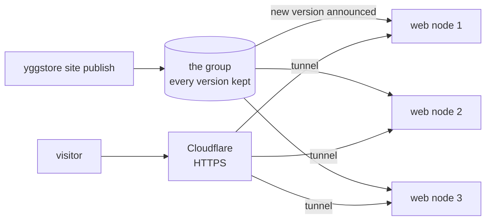

# Websites on the group

Static websites (HTML, CSS, images, JavaScript) can live on the group
instead of on one server. Several machines serve them; if one goes down, or
its whole site loses power or internet, visitors are sent to the others.



- **Publishing** stores the site's folder like any other item: encrypted,
  in pieces across the group. Every version is kept, and an update stores
  only what changed.
- **Web nodes** hear about the new version within seconds, fetch it, and
  switch to it all at once, so a visitor never sees half an update. They
  serve from their own copy, so one cut off from the group keeps serving the
  version it has. One that was off catches up when it's back.
- **Cloudflare Tunnel** gives visitors HTTPS and sends each one to a web
  node that is connected.
- A site can only be changed by the machine that first published it, or by
  an admin node.

This suits plain-file sites. Anything that runs code on the server (PHP, a
database, logins) needs a server of its own.

## 1. Choose the web nodes

Two or three machines in different places are enough: say the desktop at
home and localmail at the other site. Add `-web 127.0.0.1:8480` to each
one's node command and restart it:

```sh
yggstore serve ... -web 127.0.0.1:8480
```

On a Pi, add it to `command_args` in `/etc/init.d/yggstore`, then
`rc-service yggstore restart` and `lbu commit`.

The web server only listens on the machine itself; Cloudflare reaches it
through the tunnel.

## 2. Publish a site

On a machine running a node (your desktop, say), from the folder that holds
the site:

```sh
yggstore site publish ./example.org
yggstore site publish ./public -name www.example.org    # if the folder has another name
```

The site is published under its domain name. Then:

```sh
yggstore site status        # which web nodes serve which version
```

| Command | What it does |
|---|---|
| `yggstore site publish FOLDER` | Store and serve a new version (unchanged content makes no new version) |
| `yggstore site versions DOMAIN` | List the versions, newest first |
| `yggstore site rollback DOMAIN` | Serve the version before the current one again |
| `yggstore site rollback DOMAIN ID` | Serve a particular version again |
| `yggstore site list` | Sites published from this machine |
| `yggstore site announce` | Tell web nodes about every site again, e.g. a new web node |
| `yggstore site remove DOMAIN -yes` | Stop serving it and delete every version |

The publishing machine keeps the list of versions in `~/.yggstore/sites/`.
Back it up like your stubs.

What a web node serves:

- `index.html` for a folder, and `404.html` (if the site has one) for pages
  that don't exist. Folders without `index.html` aren't listed.
- `www.example.org` as `example.org`, unless `www.example.org` is a site of
  its own.

A web node only learns about versions announced while it is a web node or
in the 30 days before. A web node added later needs `yggstore site announce`
run once on the publishing machine.

## 3. Put Cloudflare in front

Once, in the Cloudflare dashboard (Zero Trust → Networks → Tunnels):

1. **Create a tunnel** of type Cloudflared, named e.g. `group-sites`. Copy
   its token.
2. **Add a published application route** (not a "hostname route", which
   is for private access) for each site: the domain, service type **HTTP**,
   URL `localhost:8480`. To try a site under a spare name first, set
   *HTTP Settings → HTTP Host Header* to the site's real domain.

On each web node, run the connector with that token:

```sh
sudo cloudflared service install TOKEN      # Linux with systemd
```

If the machine already runs `cloudflared` for another tunnel, that command
refuses, and you must not uninstall the other one. Run this tunnel as a
second service instead, with its own (nearly empty) settings file: without
it, cloudflared also reads `/etc/cloudflared/config.yml` and joins the other
tunnel.

```sh
sudo sh -c 'umask 077; cat > /etc/cloudflared/group-sites.token'   # paste the token, Enter, Ctrl+D
echo 'no-autoupdate: true' | sudo tee /etc/cloudflared/group-sites.yml >/dev/null
sudo tee /etc/systemd/system/cloudflared-sites.service >/dev/null <<'UNIT'
[Unit]
Description=cloudflared tunnel for the group's websites
After=network-online.target
Wants=network-online.target

[Service]
ExecStart=/usr/bin/cloudflared --config /etc/cloudflared/group-sites.yml tunnel run --token-file /etc/cloudflared/group-sites.token
Restart=on-failure
RestartSec=5s

[Install]
WantedBy=multi-user.target
UNIT
sudo systemctl daemon-reload && sudo systemctl enable --now cloudflared-sites
journalctl -u cloudflared-sites -n 30 | grep -o 'tunnelID=[0-9a-f-]*' | tail -1   # must be this tunnel's ID
```

On Alpine, run `cloudflared tunnel run --token TOKEN` from an OpenRC
service, as the Pis did for the old Yggdrasil link.

Every web node runs the **same** tunnel. Cloudflare counts each as a
replica and sends visitors only to replicas that are connected.

To move a site that is on a server now: publish it, add the public hostname,
and check it, before you remove the old copy.

## Checking it works

```sh
curl -H 'Host: example.org' http://127.0.0.1:8480/      # on a web node
yggstore site status                                   # on any machine
```

To test failover, stop one web node's connector
(`sudo systemctl stop cloudflared`) and reload the site in a browser.
